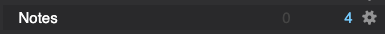
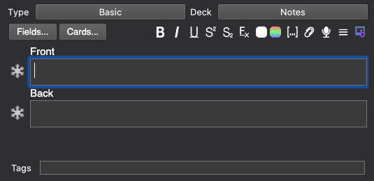
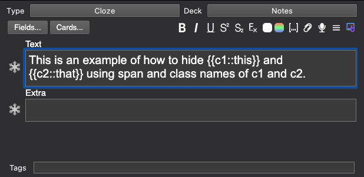
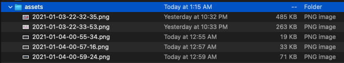

# HTML to Anki Converter

The aim of this program will be to convert from HTML to Anki cards using JavaScript. The program will be able to parse through two types of Note types: Basic (Front/Back) and Cloze deletions. The aim of the program is to display a webpage and/or pdf for viewing, but through the use of classes to parse through and generate Anki cards programmatically.

In essence it becomes a Cornell system of note taking, whereby you're taking notes, reviewing it and making questions for yourself. There is also opportunity for summarizing that occurs. In essence, this becomes a digitized method of Cornell Note taking system, and leverages spaced repetition through the use of Anki cards.

For this program to work ensure that node is installed. Node can be installed from [here](https://nodejs.org/en/).

The basic workflow of making notes and eventually making cards is as follows:

1. Make Notes in Markdown
2. Adding HTML tags in Markdown as necessary
3. Export Markdown to HTML
4. Run
   ```javascript
   node parseHTML.js html_file_to_Ankify.html
   ```

For your convenience a `test.md` and a `test.html` file has been added, so that you can see what format the markdown and HTML file needs to be in.

After downloading this respository, open terminal and run the following commands in the folder to install dependencies :

```
npm install
```

Now to test this program on the test.html file, first ensure that the Anki program is open.

Then run:

```
node parseHTML.js test.html
```

Voila!!! Hopefully at this point 4 cards have been created in the Anki Notes deck as per below:



## Theory and Deeper Working Knowledge

When it comes to adding cues, there is a specific syntax that needs to be followed, and for the purposes of this program, the following Anki note types will be supported:

1. Basic
2. Cloze

All notes will be put into the "Notes" deck from where a user can then decide to put them into other decks and tag cards accordingly.

## Parse Basic File

To make a note, you need to figure out what the Front and Back of the card is going to look like.
Structure of html should follow the following class names:

```html
<div class="anki-basic">
  <div class="front">Add front content including images here</div>
  <div class="back">Add back content including images here</div>
</div>
```

This is similar to the Front and Back fields found in Anki notes.



Note: it does not matter if the tag is a div or any other tag, as long as the class matches.

## Parse Cloze Deletions

The structure of the file should be as follows:

```html
<div class="anki-cloze">
  <div class="cloze-text">
    This is an example of how to hide <span class="c1">this</span> and
    <span class="c2">that</span> using span and class names of c1 and c2.
  </div>

  <div class="extra">Add extra information including images here</div>
</div>
```

This is similar to the cloze deletion note type found in Anki.



In essence, HTML tags are added in order to add metadata so as to transcribe to Anki format.

## Adding Pictures

The first step is to add an assets folder in the current working directory, and placing all the images in there. These need to be referenced in the HTML file.



A lot of markdown editors can automatically place images into a folder of your choice (in this case assets), when pasting from your clipboard, so definitely use that to speed up the process of loading images.
