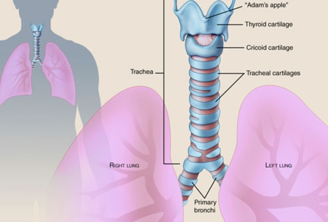
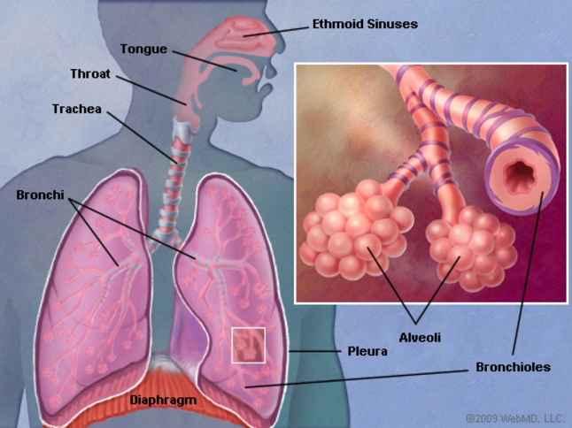

# Test File

## Parse Basic File

The  lungs are a pair of spongy, air-filled organs located on either side of the chest (thorax). The  trachea (windpipe) conducts inhaled air into the lungs through its tubular branches, called  bronchi.

What is the main function of the lung?

The main function of lung is to take oxygen from the environment and transfer it to the bloodstream

What is the function of lungs?

